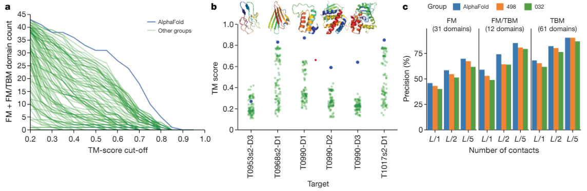

# Improved protein structure prediction using potentials from deep learning
# 딥 러닝의 잠재력을 사용하여 향상된 단백질 구조 예측

Protein structure prediction can be used to determine the three-dimensional shape of a protein from its amino acid sequence.
단백질 구조 예측은 아미노산 서열에서 단백질의 3차원 모양을 결정하는 데 사용할 수 있습니다.

This problem is of fundamental importance as the structure of a protein largely determines its function;
이 문제는 단백질의 구조가 기능을 크게 결정하기 때문에 근본적으로 중요합니다.

however, protein structures can be difficult to determine experimentally.
그러나 단백질 구조는 실험적으로 결정하기 어려울 수 있습니다.

Considerable progress has recently been made by leveraging genetic information.
최근 유전 정보를 활용하여 상당한 진전이 이루어졌습니다.

It is possible to infer which amino acid residues are in contact by analysing covariation in homologous sequences,
상동 서열의 공변성을 분석하여 어떤 아미노산 잔기가 접촉하고 있는지 유추할 수 있으며,

which aids in the prediction of protein structures.
이는 단백질 구조의 예측을 돕습니다.

Here we show that we can train a neural network to make accurate predictions of the distances between pairs of residues,
여기서 우리는 신경망을 훈련하여 잔기 쌍 사이의 거리를 정확하게 예측할 수 있음을 보여줍니다.

which convey more information about the structure than contact predictions.
접촉 예측보다 구조에 대한 더 많은 정보를 전달합니다.

Using this information, we construct a potential of mean force that can accurately describe the shape of a protein.
이 정보를 사용하여 단백질의 모양을 정확하게 설명할 수 있는 평균 힘의 잠재력을 구성합니다.

We find that the resulting potential can be optimized by a simple gradient descent algorithm to generate structures without complex sampling procedures.
우리는 복잡한 샘플링 절차 없이 구조를 생성하기 위해 간단한 기울기 하강 알고리즘으로 결과 잠재력을 최적화할 수 있음을 발견했습니다.

The resulting system, named AlphaFold, achieves high accuracy, even for sequences with fewer homologous sequences.
AlphaFold라는 이름의 결과 시스템은 상동 시퀀스가 더 적은 시퀀스에 대해서도 높은 정확도를 달성합니다.

In the recent Critical Assessment of Protein Structure Prediction5 (CASP13)—a blind assessment of the state of the field—AlphaFold created high-accuracy structures (with template modelling (TM) scores of 0.7 or higher) for 24 out of 43 free modelling domains,
최근 CASP13(Critical Assessment of Protein Structure Prediction)(현장 상태에 대한 블라인드 평가)에서 AlphaFold는 43개의 무료 모델링 도메인 중 24개에 대해 고정밀 구조(템플릿 모델링(TM) 점수 0.7 이상)를 생성했습니다.

whereas the next best method, which used sampling and contact information, achieved such accuracy for only 14 out of 43 domains.
반면 샘플링과 연락처 정보를 사용한 차선책은 43개 영역 중 14개 영역에서만 이러한 정확도를 달성했습니다.

AlphaFold represents a considerable advance in protein-structure prediction.
AlphaFold는 단백질 구조 예측의 상당한 발전을 나타냅니다.

We expect this increased accuracy to enable insights into the function and malfunction of proteins, especially in cases for which no structures for homologous proteins have been experimentally determined
우리는 특히 상동 단백질에 대한 구조가 실험적으로 결정되지 않은 경우에 단백질의 기능 및 오작동에 대한 통찰력을 가능하게 하는 이 증가된 정확도를 기대합니다.

---

Proteins are at the core of most biological processes.
단백질은 대부분의 생물학적 과정의 핵심입니다.

As the function of a protein is dependent on its structure, understanding protein structures has been a grand challenge in biology for decades.
단백질의 기능은 그 구조에 의존하기 때문에 단백질 구조를 이해하는 것은 수십 년 동안 생물학에서 큰 도전이었습니다.

Although several experimental structure determination techniques have been developed and improved in accuracy, they remain difficult and timeconsuming.
몇 가지 실험적 구조 결정 기술이 개발되고 정확도가 향상되었지만 여전히 어렵고 시간이 많이 걸립니다

As a result, decades of theoretical work has attempted to predict protein structures from amino acid sequences.
그 결과 수십 년 동안 아미노산 서열로부터 단백질 구조를 예측하기 위한 이론적 작업이 시도되었습니다.

CASP5 is a biennial blind protein structure prediction assessment run by the structure prediction community to benchmark progress in accuracy.
CASP5는 정확도 진행을 벤치마킹하기 위해 구조 예측 커뮤니티에서 실행하는 2년마다 수행되는 블라인드 단백질 구조 예측 평가입니다.

In 2018, AlphaFold joined 97 groups from around the world in entering CASP138.
2018년 AlphaFold는 CASP13에 진입하기 위해 전 세계 97개 그룹에 합류했습니다.

Each group submitted up to 5 structure predictions for each of 84 protein sequences for which experimentally determined structures were sequestered.
각 그룹은 실험적으로 결정된 구조가 격리된 84개의 단백질 서열 각각에 대해 최대 5개의 구조 예측을 제출했습니다.

Assessors divided the proteins into 104 domains for scoring and classified each as being amenable to templatebased modelling
평가자는 점수를 매기기 위해 단백질을 104개 도메인으로 나누고 각각을 템플릿 기반 모델링에 적합한 것으로 분류했습니다.

(TBM, in which a protein with a similar sequence has a known structure, and that homologous structure is modified in accordance with the sequence differences)
(유사한 서열을 가진 단백질이 구조를 알고 있고, 그 상동 구조가 서열의 차이에 따라 변형되는 TBM)

or requiring free modelling (FM, in cases in which no homologous structure is available), with an intermediate (FM/TBM) category.
또는 중간(FM/TBM) 범주와 함께 무료 모델링(FM, 상동 구조를 사용할 수 없는 경우)이 필요합니다.

Figure 1a shows that AlphaFold predicts more FM domains with high accuracy than any other system, particularly in the 0.6–0.7 TM-score range.
그림 1a는 AlphaFold가 특히 0.6–0.7 TM 점수 범위에서 다른 시스템보다 더 많은 FM 영역을 높은 정확도로 예측한다는 것을 보여줍니다.

The TM score—ranging between 0 and 1—measures the degree of match of the overall (back-bone) shape of a proposed structure to a native structure.
0에서 1 사이의 TM 점수는 제안된 구조의 전체(백본) 모양이 기본 구조와 일치하는 정도를 측정합니다.

The assessors ranked the 98 participating groups by the summed, capped z-scores of the structures, separated according to category.
평가자들은 범주에 따라 분리된 구조의 합산된 z-점수에 따라 98개 참여 그룹의 순위를 매겼습니다.

AlphaFold achieved a summed z-score of 52.8 in the FM category (best-of-five) compared with 36.6 for the next closest group (322).
AlphaFold는 FM 카테고리에서 52.8의 합산 z-점수(5전 2선승제)를 달성했으며, 그 다음으로 가장 가까운 그룹(322)에서는 36.6을 기록했습니다.

Combining FM and TBM/FM categories, AlphaFold scored 68.3 compared with 48.2.
FM과 TBM/FM 카테고리를 합친 AlphaFold는 48.2점에서 68.3점을 받았습니다.

AlphaFold is able to predict previously unknown folds to high accuracy (Fig.1b). Despite using only FM techniques and not using templates,
AlphaFold는 이전에 알려지지 않은 접힘을 높은 정확도로 예측할 수 있습니다(그림 1b). FM 기법만을 사용하고 템플릿을 사용하지 않음에도 불구하고,

AlphaFold also scored well in the TBM category according to the assessors’ for-mula 0-capped z-score, ranking fourth for the top-one model or first for the best-of-five models.
AlphaFold는 또한 평가자의 공식 0-capped z-score에 따라 TBM 범주에서 좋은 점수를 받았으며, 상위 1개 모델의 경우 4위, 5개 중 1개의 모델에 대해 1위를 차지했습니다.

Much of the accuracy of AlphaFold is due to the accuracy of the distance predictions, which is evident from the high precision of the corresponding contact predictions (Fig.1c and Extended Data Fig.2a).
AlphaFold의 정확도의 대부분은 거리 예측의 정확도 때문이며, 이는 해당 접촉 예측의 높은 정확도에서 분명합니다 (그림 1c 및 확장 데이터 그림 2a).

The most-successful FM approaches thus far9–11 have relied on fragment assembly.
지금까지 가장 성공적인 FM 접근법9-11은 단편 조립에 의존했습니다.

In these approaches, a structure is created through a stochastic sampling process—such as simulated annealing12—that minimizes a statistical potential that is derived from summary statistics extracted from structures in the Protein Data Bank (PDB).
이러한 접근 방식에서는 PDB(Protein Data Bank)의 구조에서 추출한 요약 통계에서 파생된 통계적 가능성을 최소화하는 시뮬레이션된 어닐링과 같은 확률적 샘플링 프로세스를 통해 구조가 생성됩니다.

In fragment assembly, a structure hypothesis is repeatedly modified, typically by changing the shape of a short section while retaining changes that lower the potential, ultimately leading to low potential structures.
단편 조립에서 구조 가설은 일반적으로 전위를 낮추는 변경을 유지하면서 짧은 섹션의 모양을 변경하여 반복적으로 수정되어 궁극적으로 낮은 전위 구조로 이어집니다.

Simulated annealing requires many thousands of such moves and must be repeated many times to have good coverage of low-potential structures.
시뮬레이션된 어닐링은 수천 번의 그러한 움직임을 필요로 하며 낮은 전위 구조를 잘 다루기 위해 여러 번 반복해야 합니다.

In recent years, the accuracy of structure predictions has improved through the use of evolutionary covariation data that are found in sets of related sequences.
최근 몇 년 동안 관련 시퀀스 집합에서 발견되는 진화적 공변량 데이터를 사용하여 구조 예측의 정확도가 향상되었습니다.

Sequences that are similar to the target sequence are found by searching large datasets of protein sequences derived from DNA sequencing and aligned to the target sequence to generate a multiple sequence alignment (MSA).
표적 서열과 유사한 서열은 다중 서열 정렬(MSA)을 생성하기 위해 표적 서열에 정렬되고 DNA 시퀀싱에서 파생된 단백질 서열의 대규모 데이터세트를 검색하여 찾을 수 있습니다.

Correlated changes in the posi-tions of two amino acid residues across the sequences of the MSA can be used to infer which residues might be in contact. Contacts are typically defined to occur when the β-carbon atoms of 2 residues are within 8Å of one another.
MSA의 서열에 걸친 2개의 아미노산 잔기 위치의 상관된 변화를 사용하여 어떤 잔기가 접촉할 수 있는지 추론할 수 있습니다. 접촉은 일반적으로 2개 잔기의 β-탄소 원자가 서로 8Å 이내에 있을 때 발생하는 것으로 정의됩니다.

Several methods15–18, including neural networks19–22, have been used to predict the probability that a pair of residues is in contact based on features computed from MSAs.
신경망 19-22를 포함한 여러 방법 15-18은 MSA에서 계산된 기능을 기반으로 한 쌍의 잔기가 접촉할 확률을 예측하는 데 사용되었습니다.

Contact predictions are incorporated in structure predictions by modifying the statistical potential to guide the folding process to structures that satisfy more of the predicted contacts11,23.
접촉 예측은 예측된 접촉을 더 많이 충족시키는 구조로 접는 프로세스를 안내하기 위해 통계적 잠재력을 수정하여 구조 예측에 통합됩니다.

Other studies24,25 have used predictions of the distance between residues, particularly for distance geometry approaches26–28.
다른 연구 24,25는 특히 거리 기하학 접근에 대해 잔류물 사이의 거리 예측을 사용했습니다.

Neural network distance predictions without covari-ation features were used to make the evolutionary pairwise distance-dependent statistical potential25, which was used to rank structure hypotheses.
상관 기능이 없는 신경망 거리 예측을 사용하여 구조 가설의 순위를 지정하는 데 사용된 진화적 쌍별 거리 종속 통계 잠재력을 만들었습니다.

In addition, the QUARK pipeline used a template-based distance-profile restraint for TBM.
또한, QUARK 파이프라인은 TBM에 대한 템플릿 기반 거리 프로파일 제한을 사용했습니다.

In this study, we present a deep-learning approach to protein struc-ture prediction, the stages of which are illustrated in Fig.2a.
이 연구에서 우리는 단백질 구조 예측에 대한 딥 러닝 접근 방식을 제시하며 그 단계는 그림 2a에 나와 있습니다.

We show that it is possible to construct a learned, protein-specific potential by training a neural network (Fig.2b) to make accurate predictions about the structure of the protein given its sequence, and to predict the structure itself accurately by minimizing the potential by gradient descent (Fig.2c).
우리는 신경망(그림 2b)을 훈련하여 주어진 서열이 주어진 단백질의 구조에 대해 정확한 예측을 하고, 전위를 최소화함으로써 구조 자체를 정확하게 예측하도록 학습된 단백질 특이적 잠재력을 구성하는 것이 가능함을 보여줍니다(그림 2b). 경사하강법(그림 2c).

The neural network predictions include backbone torsion angles and pairwise distances between residues. Distance predictions provide more specific information about the structure than contact predictions and provide a richer training signal for the neural network.
신경망 예측에는 백본 비틀림 각도와 잔류물 사이의 쌍별 거리가 포함됩니다. 거리 예측은 접촉 예측보다 구조에 대한 더 구체적인 정보를 제공하고 신경망에 더 풍부한 훈련 신호를 제공합니다.

By jointly predicting many distances, the network can propagate distance information that respects covariation, local structure and residue identities of nearby residues.
많은 거리를 공동으로 예측함으로써 네트워크는 공변, 국소 구조 및 인근 잔류물의 잔류물 ID를 존중하는 거리 정보를 전파할 수 있습니다.

The predicted probability distributions can be combined to form a simple, principled protein-specific potential.
예측된 확률 분포는 결합되어 단순하고 원칙적인 단백질 특이적 잠재력을 형성할 수 있습니다.

We show that with gradient descent, it is simple to find a set of torsion angles that minimizes this protein-specific potential using only limited sampling.
우리는 경사 하강법을 사용하여 제한된 샘플링만 사용하여 이 단백질 특정 잠재력을 최소화하는 일련의 비틀림 각도를 찾는 것이 간단하다는 것을 보여줍니다.

We also show that whole chains can be optimized simultaneously, avoiding the need to segment long proteins into hypothesized domains that are modelled independently as is common practice (see Methods).
우리는 또한 전체 사슬이 동시에 최적화될 수 있음을 보여주므로 긴 단백질을 일반적인 관행처럼 독립적으로 모델링되는 가설 도메인으로 분할할 필요가 없습니다(방법 참조).

The central component of AlphaFold is a convolutional neural network that is trained on PDB structures to predict the distances dij between the Cβ atoms of pairs, ij, of residues of a protein.
AlphaFold의 중심 구성요소는 단백질 잔기의 쌍 ij의 Cβ 원자 사이의 거리 dij를 예측하기 위해 PDB 구조에 대해 훈련된 컨볼루션 신경망입니다.

On the basis of a representation of the amino acid sequence, S, of a protein and features derived from the MSA(S) of that sequence, the network, which is similar in structure to those used for image-recognition tasks29, predicts a discrete probability distribution P(d_ij|S,MSA(S)) for every ij pair in any 64×64 region of the L×L distance matrix, as shown in Fig.2b.
단백질의 아미노산 서열 S와 해당 서열의 MSA(S)에서 파생된 특징을 기반으로 이미지 인식 작업29에 사용되는 것과 구조가 유사한 네트워크는 이산 그림 2b와 같이 L×L 거리 행렬의 64×64 영역에 있는 모든 ij 쌍에 대한 확률 분포 P(d_ij|S, MSA(S)).

The full set of distance distribution predictions constructed by combining such predictions that covers the entire distance map is termed a distogram (from distance histogram).
전체 거리 맵을 포함하는 이러한 예측을 결합하여 구성된 거리 분포 예측의 전체 세트를 디스토그램(from distance histogram)이라고 합니다.

Example distogram predictions for one CASP protein, T0955, are shown in Fig.3c, d.
하나의 CASP 단백질 T0955에 대한 예시 디스토그램 예측이 그림 3c, d에 나와 있습니다.

The modes of the distribution (Fig.3c) can be seen to closely match the true distances (Fig.3b).
분포 모드(그림 3c)는 실제 거리(그림 3b)와 거의 일치하는 것으로 볼 수 있습니다.

Example distributions for all distances to one residue (residue 29) are shown in Fig.3d.
하나의 잔류물(잔기 29)까지의 모든 거리에 대한 분포의 예는 그림 3d에 나와 있습니다.

We found that the predictions of the distance correlate well with the true distance between residues (Fig.3e). Furthermore, the network also models the uncertainty in its predictions (Fig.3f).
우리는 거리의 예측이 잔류물 사이의 실제 거리와 잘 상관된다는 것을 발견했습니다(그림 3e). 또한 네트워크는 예측의 불확실성도 모델링합니다(그림 3f).

When the s.d. of the predicted distribution is low, the predictions are more accurate.
언제 s.d. 예측 분포가 낮을수록 예측이 더 정확합니다.

This is also evident in Fig.3d, in which moreconfident predictions of the distance distribution (higher peak and lower s.d. of the distribution) tend to be more accurate, with the true distance close to the peak.
이것은 또한 그림 3d에서도 분명하며, 거리 분포(분포의 더 높은 피크 및 더 낮은 sd.)에 대한 더 확실한 예측이 더 정확한 경향이 있으며 실제 거리가 피크에 가깝습니다.

Broader, less-confidently predicted distributions still assign probability to the correct value even when it is not close to the peak.
더 광범위하고 덜 확실하게 예측된 분포는 피크에 가깝지 않은 경우에도 올바른 값에 여전히 확률을 할당합니다.

The high accuracy of the distance predictions and consequently the contact predictions (Fig.1c) comes from a com-bination of factors in the design of the neural network and its training, data augmentation, feature representation, auxiliary losses, cropping and data curation (see Methods).
거리 예측의 높은 정확도와 결과적으로 접촉 예측(그림 1c)은 신경망 설계와 훈련, 데이터 증대, 특징 표현, 보조 손실, 자르기 및 데이터 큐레이션의 요소 조합에서 비롯됩니다. 방법 참조).

To generate structures that conform to the distance predictions, we constructed a smooth potential Vdistance by fitting a spline to the negative log probabilities, and summing across all of the residue pairs (see Methods).
거리 예측을 따르는 구조를 생성하기 위해 음의 로그 확률에 스플라인을 맞추고 모든 잔류물 쌍에 대해 합산하여 부드러운 전위 Vdistance를 구성했습니다(방법 참조).

We parameterized protein structures by the backbone torsion angles (φ, ψ) of all residues and build a differentiable model of protein geometry x=G(φ,ψ) to compute the Cβ coordinates, xi for all residues i and thus the inter-residue distances, dij=||xi−xj||, for each structure, and express Vdistance as a function of φ and ψ.
우리는 모든 잔기의 백본 비틀림 각도(φ, ψ)에 의해 단백질 구조를 매개변수화하고 모든 잔기 i에 대한 Cβ 좌표, xi를 계산하기 위해 단백질 기하학 x=G(φ,ψ)의 미분 가능한 모델을 구축합니다. 각 구조에 대한 잔류물간 거리 dij=||xi−xj||, Vdistance를 φ와 ψ의 함수로 표현합니다.

For a protein with L residues, this potential accumulates L2 terms from marginal distribu-tion predictions. To correct for the overrepresentation of the prior, we subtract a reference distribution30 from the distance potential in the log domain.
L 잔기가 있는 단백질의 경우 이 전위는 한계 분포 예측에서 L2 항을 축적합니다. 사전의 과잉 표현을 수정하기 위해 로그 도메인의 거리 전위에서 참조 분포30를 뺍니다.

The reference distribution models the distance distributions P(dij|length) independent of the protein sequence and is computed by training a small version of the distance prediction neural network on the same structures, without sequence or MSA input features.
참조 분포는 단백질 시퀀스와 독립적인 거리 분포 P(dij|length)를 모델링하고 시퀀스 또는 MSA 입력 기능 없이 동일한 구조에서 거리 예측 신경망의 작은 버전을 훈련하여 계산됩니다.

A separate output head of the contact prediction network is trained to predict discrete probability distributions of backbone torsion angles P(φi,ψi|S,MSA(S)).
접촉 예측 네트워크의 개별 출력 헤드는 백본 비틀림 각도 P(φi,ψi|S,MSA(S))의 이산 확률 분포를 예측하도록 훈련됩니다.

After fitting a von Mises distribution, this is used to add a smooth torsion modelling term, Vtorsion, to the potential.
von Mises 분포를 피팅한 후 이것은 부드러운 비틀림 모델링 용어인 Vtorsion을 전위에 추가하는 데 사용됩니다.

Finally, to prevent steric clashes, we add the Vscore2_smooth score of Rosetta9 to the potential, as this incorporates a vander Waals term. We used multipli-cative weights for each of the three terms in the potential; however, no combination of weights noticeably outperformed equal weighting.
마지막으로, 입체 충돌을 방지하기 위해 Vscore2_smooth 점수인 Rosetta9를 전위에 추가합니다. 여기에는 반데르 발스 항이 포함되어 있기 때문입니다. 우리는 포텐셜의 세 항 각각에 대해 곱셈 가중치를 사용했습니다. 그러나 가중치의 조합이 동일한 가중치를 눈에 띄게 능가하지 않았습니다.

[Reference](https://www.nature.com/articles/s41586-019-1923-7.epdf?author_access_token=Z_KaZKDqtKzbE7Wd5HtwI9RgN0jAjWel9jnR3ZoTv0MCcgAwHMgRx9mvLjNQdB2TlQQaa7l420UCtGo8vYQ39gg8lFWR9mAZtvsN_1PrccXfIbc6e-tGSgazNL_XdtQzn1PHfy21qdcxV7Pw-k3htw%3D%3D)
